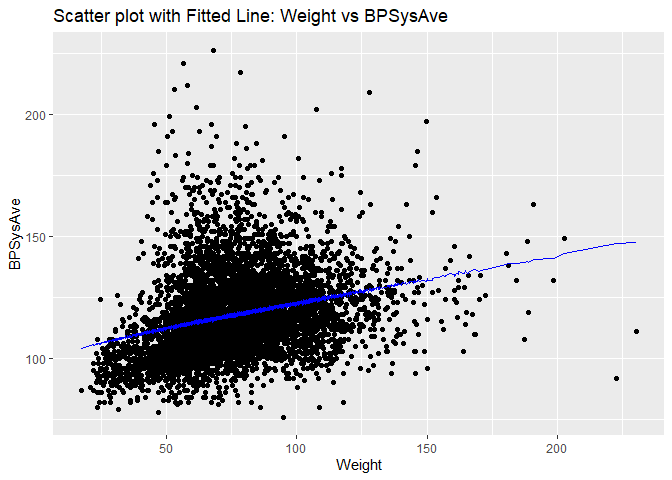

<!-- README.md is generated from README.Rmd. Please edit that file -->

# HW3

<!-- badges: start -->

[](https://github.com/Kumachar/BIOSTAT625HW3B/actions/workflows/R-CMD-check.yaml)
[](https://app.codecov.io/gh/Kumachar/BIOSTAT625HW3B?branch=master)
<!-- badges: end -->

The goal of this package HW3 is to facilitate get linear regression
result and its analysis. It includes functions for building linear
models, making predictions, testing parameters, and summarizing model
results.

## Installation

You can install the newest version of HW3 from
[GitHub](https://github.com/) with:

``` r
# install.packages("devtools")
devtools::install_github("Kumachar/BIOSTAT625HW3B")
```

## Function Usage

1.  **linear_model(X, y, intercept = TRUE)**: Builds a linear model.
    -   `X`: Predictor variables (matrix or data frame).
    -   `y`: Response variable (matrix or data frame).
    -   `intercept`: Whether to include the intercept (default: TRUE).
    -   Returns a list with model coefficients, fitted values,
        residuals, rank, mean squared error, model data, intercept
        inclusion status, and NA removal details.
2.  **parameter_t\_test(model)**: Conducts t-tests and F-tests on model
    parameters. –>
    -   `model`: The linear model object returned by `linear_model`.
    -   Returns a list with estimates, standard errors, t-values,
        p-values for t-tests, F-value, p-value for F-test, R², and
        adjusted R².
3.  **linear_prediction(X, b, intercept = TRUE)**: Generates predictions
    using the linear model.
    -   `X`: Predictor variables (matrix or data frame).
    -   `b`: Coefficients of the linear model.
    -   `intercept`: Whether the intercept was included in the model.
    -   Returns predicted values.
4.  **Linear_regression(X, y, intercept = TRUE)**: Helper function for
    `linear_model` to perform linear regression.
    -   `X`: Predictor variables (matrix or data frame).
    -   `y`: Response variable (matrix or data frame).
    -   `intercept`: Whether to include the intercept.
    -   Returns regression coefficients.
5.  **model_summary(model, show_table = TRUE)**: Summarizes the linear
    model.
    -   `model`: The linear model object returned by `linear_model`.
    -   `show_table`: Whether to display the summary table (default:
        TRUE).
    -   Returns test results and optional

Or you simply find the help page of these functions after the
installation of this package by ?function_name

## Example

This is a basic example which shows you how to solve a common problem:

``` r
library(HW3)
## basic example code
```

Now we can display a simple example of how this package works. We are
going to use linear model to predict the Miles per gallon based on horse
power and weight of a car in mtcars data.

``` r
data("mtcars")
X <- mtcars[, c("hp", "wt")]
y <- mtcars$mpg

#Construct a Multiple Linear Regression model to predict Miles per gallon based on horse power and weight of a car
model <- linear_model(X, y, intercept = TRUE)

#Now we can see the regression coefficients for each variable you use in the model
model$coefficients
#> (Intercept)          hp          wt 
#> 37.22727012 -0.03177295 -3.87783074

#Also we can predict data based on acquired coefficients use lineaer_prediction function
head(linear_prediction(X,model$coefficients))
#>         Mazda RX4     Mazda RX4 Wag        Datsun 710    Hornet 4 Drive 
#>          23.57233          22.58348          25.27582          21.26502 
#> Hornet Sportabout           Valiant 
#>          18.32727          20.47382

#There are also some useful functions to generate the result of regression 
result<-model_summary(model)
#>                Estimate Std. Error   t value     Pr(>|t|)
#> (Intercept) 37.22727012 1.59878754 23.284689 2.565459e-20
#> hp          -0.03177295 0.00902971 -3.518712 1.451229e-03
#> wt          -3.87783074 0.63273349 -6.128695 1.119647e-06
#> F-statistic:  69.21121  on  2  and  29  DF,  p-value:  9.109054e-12 
#> Multiple R-squared:  0.8267855 , Adjusted R-squared:  0.8148396

print(result)
#> $Estimate
#> (Intercept)          hp          wt 
#> 37.22727012 -0.03177295 -3.87783074 
#> 
#> $StdError
#> (Intercept)          hp          wt 
#>  1.59878754  0.00902971  0.63273349 
#> 
#> $t_value
#> (Intercept)          hp          wt 
#>   23.284689   -3.518712   -6.128695 
#> 
#> $pt_value
#>  (Intercept)           hp           wt 
#> 2.565459e-20 1.451229e-03 1.119647e-06 
#> 
#> $f_value
#> [1] 69.21121
#> 
#> $pf_value
#> [1] 9.109054e-12
#> 
#> $R2
#> [1] 0.8267855
#> 
#> $R2_adj
#> [1] 0.8148396

#You can compare these result with the original lm and summary function
model2 <- lm(mpg~hp+wt, data = mtcars)
model2$coefficients
#> (Intercept)          hp          wt 
#> 37.22727012 -0.03177295 -3.87783074

summary(model2)
#> 
#> Call:
#> lm(formula = mpg ~ hp + wt, data = mtcars)
#> 
#> Residuals:
#>    Min     1Q Median     3Q    Max 
#> -3.941 -1.600 -0.182  1.050  5.854 
#> 
#> Coefficients:
#>             Estimate Std. Error t value Pr(>|t|)    
#> (Intercept) 37.22727    1.59879  23.285  < 2e-16 ***
#> hp          -0.03177    0.00903  -3.519  0.00145 ** 
#> wt          -3.87783    0.63273  -6.129 1.12e-06 ***
#> ---
#> Signif. codes:  0 '***' 0.001 '**' 0.01 '*' 0.05 '.' 0.1 ' ' 1
#> 
#> Residual standard error: 2.593 on 29 degrees of freedom
#> Multiple R-squared:  0.8268, Adjusted R-squared:  0.8148 
#> F-statistic: 69.21 on 2 and 29 DF,  p-value: 9.109e-12
```

##This function can also work with other packages


In that case, don’t forget to commit and push the resulting figure
files, so they display on GitHub and CRAN.
